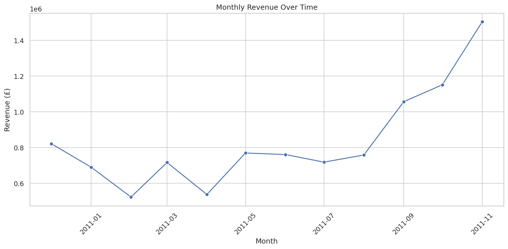
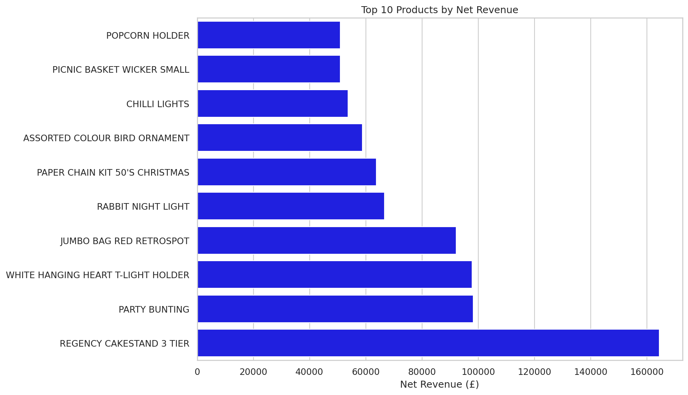
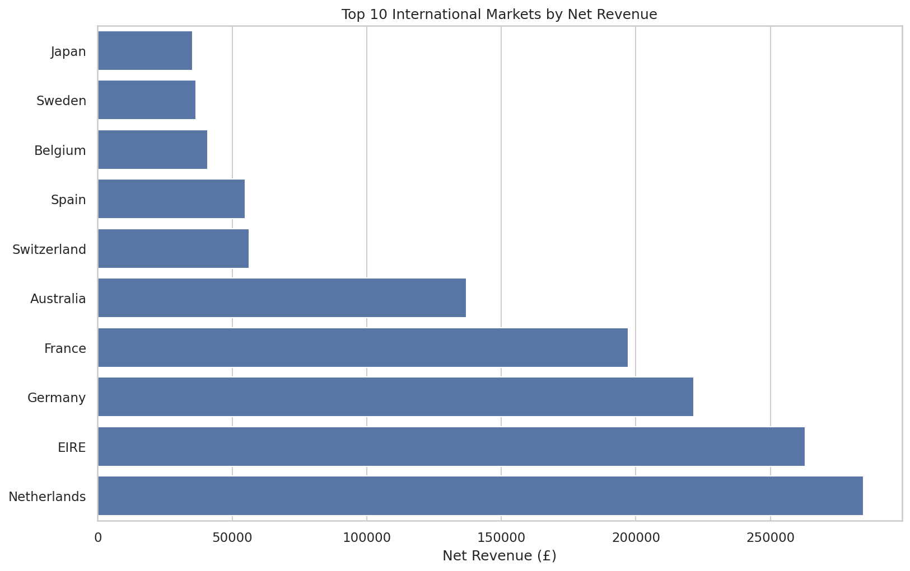
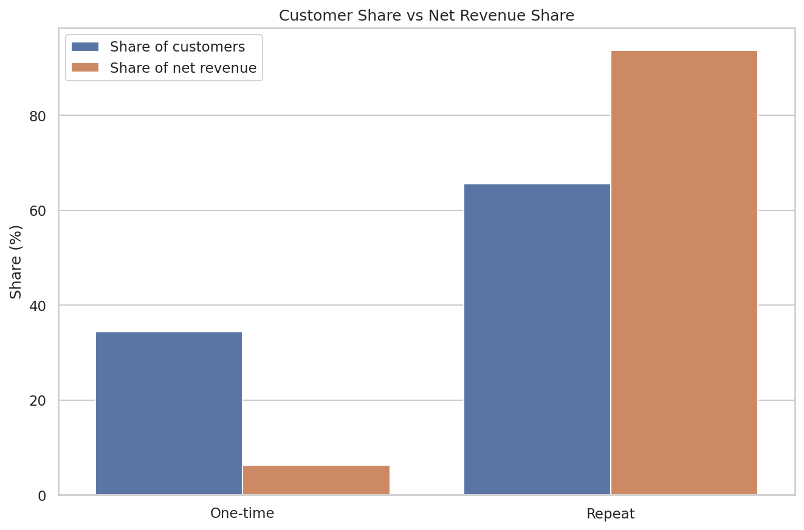

# Online Retail Sales Analysis

[](https://colab.research.google.com/github/Brutva/online-retail-analysis/blob/main/notebooks/online_retail_analysis.ipynb)

Business-oriented exploratory data analysis of real transaction data from a UK-based online retailer. The project examines revenue trends, product performance, cancellations, geographic markets, and customer behavior to produce practical business recommendations.

## Project objective

The objective is to answer five business questions:

1. How does revenue change over time, and is there a seasonal pattern?
2. Which products generate the most revenue and sales volume?
3. How strongly do cancellations affect revenue?
4. Which countries are the most valuable international markets?
5. How important are repeat customers and the highest-value customers?

## Dataset

The project uses the [Online Retail dataset from the UCI Machine Learning Repository](https://archive.ics.uci.edu/dataset/352/online-retail). It contains transactions made by a UK-based non-store retailer between December 2010 and December 2011. The company mainly sells gifts, and many of its customers are wholesalers.

- **Raw rows:** 541,909
- **Columns:** 8
- **Period:** 1 December 2010 – 9 December 2011
- **Currency:** Pound sterling (£)
- **Main fields:** invoice, product, quantity, price, customer, date, and country

The raw Excel file is not stored in the repository. Download `Online Retail.xlsx` from UCI and save it locally as `data/online_retail.xlsx`.

## Tools

- Python
- pandas
- matplotlib
- seaborn
- openpyxl
- Jupyter Notebook / Google Colab
- Git and GitHub

## Analysis workflow

1. Inspected data types, missing values, duplicates, and invalid records.
2. Removed duplicate rows and separated positive sales from cancellations.
3. Calculated gross revenue, cancelled revenue, and estimated net revenue.
4. Analyzed monthly revenue, orders, and customer activity.
5. Compared products by net revenue, units sold, and order frequency.
6. Evaluated country-level revenue and cancellation rates.
7. Compared one-time and repeat customers.
8. Measured revenue concentration among the highest-value customers.
9. Converted analytical findings into business recommendations.

## Key performance indicators

| Metric | Result |
|---|---:|
| Positive sales rows after cleaning | 524,878 |
| Gross revenue | £10,642,110.80 |
| Cancelled revenue | £893,979.73 |
| Estimated net revenue | £9,748,131.07 |
| Cancellation rate | 8.40% |
| Positive sales orders | 19,960 |
| Average order value | £533.17 |
| Identified customers | 4,338 |

## Main findings

### Revenue and seasonality

- November 2011 was the strongest complete month, generating **£1,503,866.78** in gross revenue.
- Revenue increased strongly between September and November, indicating an important autumn sales peak.
- December 2011 contains only nine days of data and was excluded from complete-month comparisons.



### Products

- `REGENCY CAKESTAND 3 TIER` generated the highest product net revenue at **£164,459.49**.
- `POPCORN HOLDER` had the highest net sales volume with **56,427 units**.
- Product rankings changed after cancellations were included, demonstrating why gross sales alone can be misleading.



### Countries

- The United Kingdom generated approximately **84% of total net revenue**, showing strong dependence on the domestic market.
- The Netherlands was the largest international market with **£284,661.54** in net revenue and a cancellation rate of only **0.27%**.
- Germany and France had more diversified customer bases than several other international markets.
- Spain had the highest cancellation rate among the leading markets at **11.05%**.



### Customers

- Customer-level analysis covers **4,338 identified customers** associated with **85.03% of total net revenue**.
- Repeat customers represented **65.58%** of identified customers but generated **93.74%** of identified net revenue.
- The top 10 customers generated **16.51%** of identified net revenue, indicating noticeable but not extreme concentration.



## Business recommendations

1. **Prioritize repeat-customer retention.** Use loyalty offers, personalized recommendations, and reactivation campaigns because repeat customers generate most customer-linked revenue.
2. **Investigate preventable cancellations.** Focus first on the United Kingdom and Spain, where cancellation rates are comparatively high.
3. **Prepare for the autumn sales peak.** Increase inventory and fulfilment capacity before the September–November growth period.
4. **Protect availability of proven products.** Monitor high-value and high-volume products and use them in bundles or cross-selling campaigns.
5. **Test international expansion.** The Netherlands, Germany, and France are promising markets that may reduce dependence on the UK.
6. **Provide appropriate service to high-value customers.** Personalized support is justified, although the business is not dependent on only a few customers.

## Repository structure

```text
online-retail-analysis/
├── data/
│   └── online_retail.xlsx            # Downloaded locally, not tracked by Git
├── images/
│   ├── monthly_revenue.png
│   ├── top_products_by_net_revenue.png
│   ├── top_products_by_net_units.png
│   ├── top_international_markets.png
│   ├── international_cancellation_rate.png
│   ├── customer_segment_comparison.png
│   └── top_customers_by_net_revenue.png
├── notebooks/
│   └── online_retail_analysis.ipynb
├── .gitignore
├── README.md
└── requirements.txt
```

## How to run the project

### Google Colab

1. Download the dataset from UCI.
2. Create this folder structure in Google Drive:

   ```text
   MyDrive/online-retail-analysis/data/online_retail.xlsx
   ```

3. Open `notebooks/online_retail_analysis.ipynb` in Google Colab or use the **Open in Colab** button at the top of this README.
4. Allow Colab to connect to Google Drive when requested.
5. Select **Runtime → Run all**.

The generated charts will be saved to `MyDrive/online-retail-analysis/images/`.

### Local Jupyter environment

Install the required packages:

```bash
pip install -r requirements.txt
```

Start Jupyter from the repository root:

```bash
jupyter notebook
```

The first notebook cell is configured for Google Colab. For local execution, remove the Google Drive import and mount commands, then use:

```python
PROJECT_DIR = Path.cwd()
```

Place the dataset in `data/online_retail.xlsx` and run all notebook cells.

## Limitations

- The data represents one retailer and historical transactions from 2010–2011.
- December 2011 is incomplete.
- Some transactions have no customer ID, so they cannot be included in customer-level analysis.
- Net revenue is not profit because product costs, shipping costs, discounts, taxes, and operating expenses are unavailable.
- Cancellation reasons, marketing channels, customer demographics, and product categories are not provided.

## Possible next steps

- Add RFM customer segmentation.
- Perform cohort and retention analysis.
- Investigate cancellations by product and customer segment.
- Build an interactive Streamlit or Power BI dashboard.
- Add profit analysis if product cost data becomes available.

## Dataset attribution

Chen, D. (2015). *Online Retail* [Dataset]. UCI Machine Learning Repository. [https://doi.org/10.24432/C5BW33](https://doi.org/10.24432/C5BW33). Licensed under CC BY 4.0.
